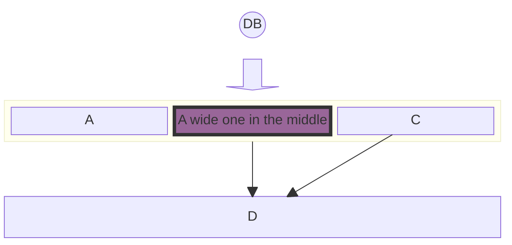
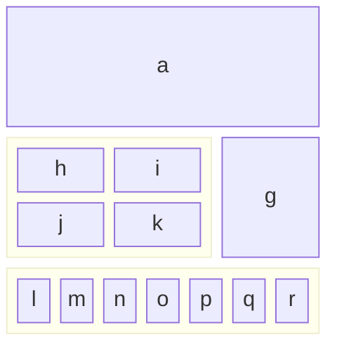
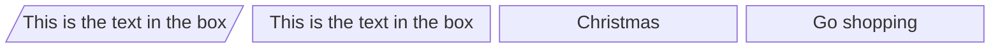
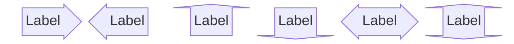
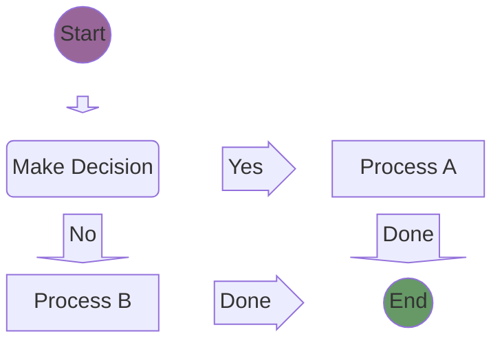
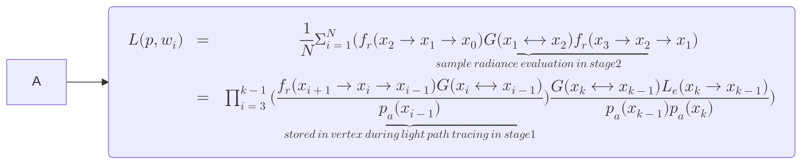
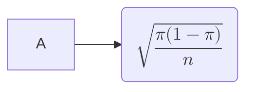

<blockquote style="border-color: #faad14;">
<p><strong>This is a modified version of the <a href="https://github.com/NG-ZORRO/ng-zorro-antd/blob/master/components/icon/doc/index.en-US.md" target="_blank" rel="noopener">NG-ZORRO original</a> document provided under <a href="https://github.com/NG-ZORRO/ng-zorro-antd/blob/master/LICENSE" target="_blank" rel="noopener">Alibaba.com MIT LICENSE</a>.</strong></p>
</blockquote>

```angular-template-block
<div class="pic-plus" style="text-align: center;">
  <nz-icon nzType="custom:zorro" nzWidth="180px" nzHeight="180px" />
  <span>+</span>
  <nz-icon nzType="custom:angular" nzWidth="180px" nzHeight="180px" />
  <span>=</span>
  <nz-icon nzType="custom:ng-zorro" nzWidth="180px" nzHeight="180px" />
</div>
```

#### Example 1



#### Example 2



#### Example 3



#### Example 4



#### Example 5



#### Example 6



#### Example 7



## List of icons

We are still adding icons right now, syncing to [antd](https://ant.design/components/icon/).

```ts
import { NzIconModule } from 'ng-zorro-antd/icon';
```

## API

### [nz-icon]

| Property           | Description                                                 | Type                                      | Default     | Global Config |
| ------------------ | ----------------------------------------------------------- | ----------------------------------------- | ----------- | ------------- |
| `[nzType]`         | Type of the ant design icon                                 | `string`                                  | -           |               |
| `[nzTheme]`        | Type of the ant design icon                                 | `'fill'\|'outline'\|'twotone'\|'feather'` | `'outline'` | ✅            |
| `[nzSpin]`         | Rotate icon with animation                                  | `boolean`                                 | `false`     |               |
| `[nzTwotoneColor]` | Only support the two-tone icon. Specific the primary color. | `string (hex color)`                      | -           | ✅            |
| `[nzIconfont]`     | Type of the icon from iconfont                              | `string`                                  | -           |               |
| `[nzRotate]`       | Rotate degrees                                              | `number`                                  | -           |               |
| `[nzWidth]`        | SVG width                                                   | `number\|string`                          | `1em`       |               |
| `[nzHeight]`       | SVG height                                                  | `number\|string`                          | `1em`       |               |

> In `feather` folder, there are all [official open source SVG icons for Bootstrap](https://github.com/twbs/icons) that can be viewed [here](https://icons.getbootstrap.com/). In `fill`,`outline` and `twotone` folders, there are all [Ant Design SVG icons](https://github.com/ant-design/ant-design-icons/tree/master/packages/icons-svg) that can be viewed [here](https://ant.design/components/icon/). In `custom` folder, there are a few SVG icons added by hand witch can be accessed by `nzType="custom:some-icon-file-name"`.

### NzIconService

| Methods/Properties     | Description                                                                                      | Parameters               |
| ---------------------- | ------------------------------------------------------------------------------------------------ | ------------------------ |
| `useJsonpLoading()`    | Call this method to switch to jsonp like loading                                                 |                          |
| `addIcon()`            | To import icons statically                                                                       | `IconDefinition`         |
| `addIconLiteral()`     | To statically import custom icons                                                                | `string`, `string (SVG)` |
| `fetchFromIconfont()`  | To get icon assets from fonticon                                                                 | `NzIconfontOption`       |
| `changeAssetsSource()` | To change the location of your icon assets, so that you can deploy these icons wherever you want | `string`                 |

### SVG icons

We synced to Ant Design and replaced font icons with svg icons which bring benefits below:

- Complete offline usage of icon, no dependency of alipay cdn font icon file and no more empty square during downloading.
- Much more display accuracy in lower-level screens.
- Support multiple colors for icon.
- No need to change built-in icons with overriding styles by providing more props in component.

You can join in [this dicussion of Ant Design](https://github.com/ant-design/ant-design/issues/10353).

NG-ZORRO hadn't provided an icon component. Instead, icon based on font files was provided. We make this new directive compatible to old API. If you make no changes to your existing code, old icons would be dynamically loaded as `outline` icons. But the best pratice is always to use `nz-icon` directive and specify the `theme` prop.

```html
<span nz-icon [nzType]="'star'" [nzTheme]="'fill'"></span>
```

All the icons will be rendered to `<svg>`, and styles and classes applied to `<i>` would work.

```html
<span nz-icon [nzType]="'message'" style="font-size: 16px; color: #08c;"></span>
```

### Static loading and dynamic loading

As for icons provided by Ant Design, there are two ways of importing them into your project.

Static loading. By registering icons to `AppModule` you load icons statically.

```ts
import { IconDefinition } from '@ant-design/icons-angular';
import { NzIconModule } from 'ng-zorro-antd/icon';

// Import what you need. RECOMMENDED. ✔️
import { AccountBookFill, AlertFill, AlertOutline } from '@ant-design/icons-angular/icons';

const icons: IconDefinition[] = [ AccountBookFill, AlertOutline, AlertFill ];

// Import all. NOT RECOMMENDED. ❌
// import * as AllIcons from '@ant-design/icons-angular/icons';

// const antDesignIcons = AllIcons as {
//   [key: string]: IconDefinition;
// };
// const icons: IconDefinition[] = Object.keys(antDesignIcons).map(key => antDesignIcons[key])

@NgModule({
  declarations: [
    AppComponent
  ],
  imports: [
    NzIconModule.forRoot(icons),
  ]
  bootstrap: [ AppComponent ]
})
export class AppModule {
}
```

Actually this calls `addIcon` of `NzIconService`. Icons imported would be bundled into your `.js` files. Static loading would increase your bundle's size so we recommend use dynamic importing as much as you can.

> Icons used by NG-ZORRO itself [(NZ_ICONS_USED_BY_ZORRO)](https://github.com/NG-ZORRO/ng-zorro-antd/blob/master/components/icon/icons.ts) are imported statically to increase loading speed. However, icons demonstrated on the official website are loaded dynamically.

Dynamic importing. This way would not increase your bundle's size. When NG-ZORRO detects that the icon you want to render hasn't been registered, it would fire a HTTP request to load it. All you have to do is to config your `angular.json` like this:

```json
{
  "assets": [
    {
      "glob": "**/*",
      "input": "./node_modules/@ant-design/icons-angular/src/inline-svg/",
      "output": "/assets/"
    }
  ]
}
```

You can call `changeAssetsSource()` of `NzIconService` to change the location of your icon assets, so that you can deploy these icon assets to cdn. The parameter you passed would be add in front of `assets/`.

Let's assume that you deploy static assets under `https://mycdn.somecdn.com/icons/assets`. You can call `changeAssetsSource('https://mycdn.somecdn.com/icons')` to tell NG-ZORRO that all your resources are located there.

Please call this in component's constructor or `AppInitService`.

### Add Icons in Lazy-loaded Modules

Sometimes, you want to import icons in lazy modules to avoid increasing the size of the main.js. You can use `NzIconModule.forChild`.

```ts
@NgModule({
  imports: [CommonModule, NzIconModule.forChild([QuestionOutline])],
})
class ChildModule {}
```

When `ChildModule` get loaded, the icon QuestionOutline would be usable across the application.

### Set Default TwoTone Color

When using the two-tone icons, you provide a global configuration like `{ nzIcon: { nzTwotoneColor: 'xxx' } }` via `NzConfigService` or call corresponding `set` method to change two default twotone color.

### Custom Font Icon

We added a `fetchFromIconfont` method function to help developer using their own icons deployed at [iconfont.cn](http://iconfont.cn/) in a convenient way.

> This method is specified for iconfont.cn.

```ts
this._iconService.fetchFromIconfont({
  scriptUrl: 'https://at.alicdn.com/t/font_8d5l8fzk5b87iudi.js',
});
```

```html
<span nz-icon [nzIconfont]="'icon-tuichu'"></span>
```

It create a component that uses SVG sprites in essence.

The following option are available:

| Property    | Description                               | Type     | Default |
| ----------- | ----------------------------------------- | -------- | ------- |
| `scriptUrl` | The URL generated by iconfont.cn project. | `string` | -       |

The property scriptUrl should be set to import the svg sprite symbols.

See [iconfont.cn](http://iconfont.cn/help/detail?spm=a313x.7781069.1998910419.15&helptype=code) documents to learn about how to generate scriptUrl.

### Namespace

We introduced namespace so you could add your own icons in a convenient way. When you wan to render an icon, you could assign `type` `namespace:name`. Dynamic importing and static importing are both supported.

Static importing. Invoke `addIconLiteral` of `NzIconService`.

Dynamic importing. Make sure that you have put your SVG resources in dir like `assets/${namespace}`. For example, if you have a `panda` icon and in `zoo` namespace, you should put `panda.svg` in `assets/zoo`.

## FAQ

### All my icons are gone

Have you read the docs above?

### There are two similar icons in a `<span></span>` tag. What happened?

In older versions of NG-ZORRO, there was a font file which would use `:before` to insert a icon according to a `i` tag's `className`. So if you have two icons, try to remove `node_modules` and reinstall. If the problem is still there, search `@icon-url` and remove that line.

### I want to import all icons statically. What should I do?

Actually we demonstrate it here:

```ts
// import * as AllIcons from '@ant-design/icons-angular/icons';

// const antDesignIcons = AllIcons as {
//   [key: string]: IconDefinition;
// };
// const icons: IconDefinition[] = Object.keys(antDesignIcons).map(key => antDesignIcons[key])
```

### Does dynamic loading affect web pages' performance?

We used several methods to reduce requests, like static cache, dynamic cache and reusable request. It's basically not noticeable for visitors that icons are loaded asynchronously assuming web connections are fairly good.

### How do I know a icon's corresponding module to import?

Capital camel-case `type & theme`, i.e. `alibaba` => `AlibabaOutline`.
